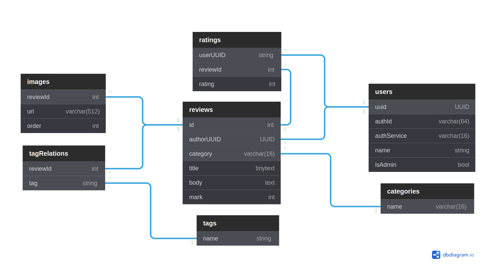

# Review Base

[Review Base](https://review-base.netlify.app) is a web application that allows people to post their reviews on books, movies, games, etc. It is built as a final task of the [iTransition](https://www.itransition.com) web-devel course.

## Requirements

### Basic

- [x] CSS Framework
- [x] Responsive UI
- [x] ORM
- [x] DB
- [x] Authentification through at least two services
- - [x] Google
- - [x] GitHub
- - [x] VKontakte
- [x] Profile page
- - [x] Karma
- - [x] List of all reviews
- - [x] Filter
- - [x] Sort
- - [x] Edit
- - [x] Delete 
- [x] Admin panel
- [x] Full-text search on every page
- [ ] Review page
- - [x] Category
- - [x] Tags
- - [x] Title
- - [x] Stars
- - [ ] Images
- - [x] Rating
- [x] Home page
- - [x] Recently added
- - [x] Most rated
- - [x] Tag cloud
- [x] Rate reviews
- [ ] UI languages
- - [x] English
- - [ ] Russian
- [x] UI themes
- - [x] Light
- - [x] Dark

### Advanced

- [ ] Comments on reviews
- [ ] Advanced admin panel
- [ ] Any number of images in reviews
- [ ] Group reviews by subject

## Technologies, Frameworks and Libraries

### Client

- [React](https://reactjs.org/)
- [React Bootstrap](https://react-bootstrap.github.io/)
- [React Bootstrap Typehead](http://ericgio.github.io/react-bootstrap-typeahead/)
- [React Router](https://reactrouter.com/)
- [React Wordcloud](https://react-wordcloud.netlify.app/)
- [Axios](https://axios-http.com/)

### Server

- [Express](https://expressjs.com/)
- [Sequelize](https://sequelize.org/)
- [Passport](http://www.passportjs.org/)

### Database

- [MySQL](https://expressjs.com/)

## Database Schema

