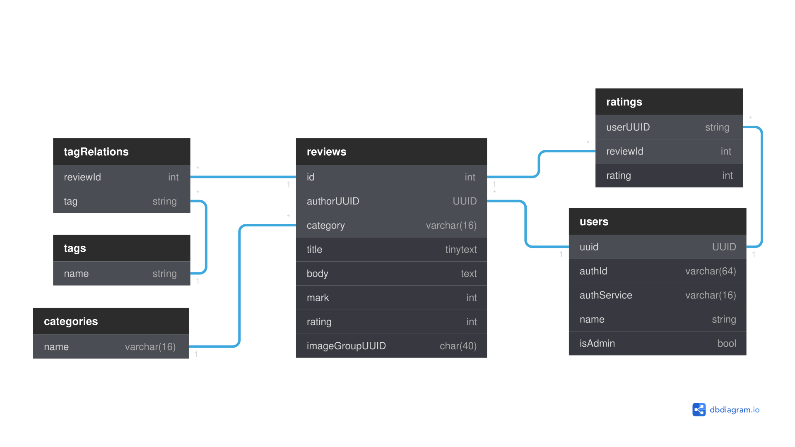

# Review Base

[Review Base](https://review-base.netlify.app) is a web application that allows people to post their reviews on books, movies, games, etc. It is built as a final task of the [iTransition](https://www.itransition.com) web-devel course.

## Requirements

### Basic

- [x] CSS Framework
- [x] Responsive UI
- [x] ORM
- [x] DB
- [x] Authentification through at least two services
- [x] Profile page (karma, list of all reviews, filter, sort, edit, delete, etc.)
- [ ] Admin panel (list of all users with links to their pages)
- [ ] Full-text search on every page
- [ ] Reviews (type, tags, body, images, stars, rating)
- [x] Home page (recently added reviews, most rated reviews, tag cloud)
- [ ] Rate reviews
- [ ] Upvote reviews (+karma to author)
- [ ] Russian and English UI languages
- [ ] Dark and light UI theme

### Advanced

- [ ] Comments on reviews
- [ ] Advanced admin panel
- [ ] Any number of images in reviews
- [ ] Group reviews by subject

## Technologies, Frameworks and Libraries

### Client

- [React](https://reactjs.org/)
- [React Bootstrap](https://react-bootstrap.github.io/)
- [React Router](https://reactrouter.com/)
- [React Wordcloud](https://react-wordcloud.netlify.app/)
- [Axios](https://axios-http.com/)

### Server

- [Express](https://expressjs.com/)
- [Sequelize](https://sequelize.org/)

### Database

- [MySQL](https://expressjs.com/)

## Database Schema

